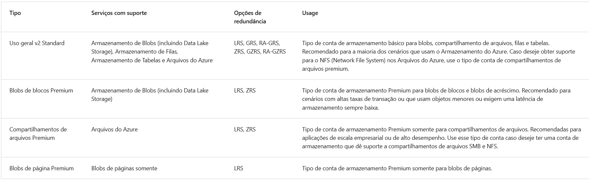
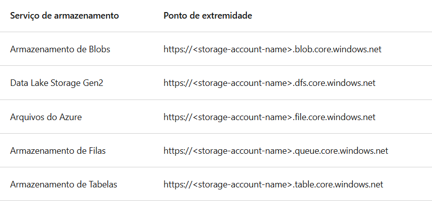
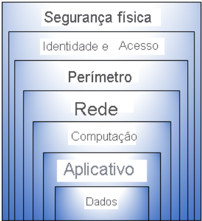

# Resumo Azure

Resumo sobre a cloud da Azure para a certificação az-900

# Introdução

Existem três modelos de nuvem.

- Nuvem privada - ambiente onpremise
- Nuvem pública - entrega de serviços para os clientes por meio de um único provider
- Nuvem híbrida - É a junção das duas outras nuvens.

## Modelos de cobrança

Despesas de capital (CapEx) - ambientes físicos

- Gasto inicial de dinheiro em infraestrutura física.
- As despesas do CapEx têm um valor que se reduz com o tempo.

Despesas operacionais (OpEx)

- Gastar com produtos e serviços conforme necessário, pagamento conforme o uso.
- Seja cobrado imediatamente.

Baseado em consumo

- Usado pelos serviços em nuvem, os usuários pagam somente pelos recursos que usam.

## Benefícios da nuvem

- Alta disponibilidade - Se refere a quanto tempo o serviço irá ficar disponível por dia/mês/ano e caso não seja cumprido esse valor será incluído um crédito na sua conta por essa indisponibilidade.
- Escalibidade - Se refere à capacidade de ajustar recursos para atender à demanda, ou seja, pode adicionar mais recursos.
- Elasticidade - Se refere a expansão dos recursos implantados ao receber um salto repentino e acentuado na demanda, ou se houver uma queda significativa na demandas os recursos serão reduzidos.
  - Por exemplo: adicionar máquinas virtuais ou contêineres.
- Confiabilidade - Se refere a possuir um design descentralizado, ou seja, posso ter recursos implantados em várias regiões do mundo. Dessa forma mesmo que ocorra um evento catastrófico em uma determinada região, outras regiões permaneceram operando.
- Previsibilidade - Se refere a confiança na nuvem, seja por desempenho ou no custo.
- Segurança - A microsoft dispoem de vários recursos de segurança, mas cabe ao administrador da nuvem implantar e gerenciar esses recursos conforme a necessidade.
- Governança - (Auditoria) Auxilia a sinalizar qualquer recurso que esteja fora de conformidade com seus padrões corporativos e fornece estratégias de solução. - Por exemplo: patches de software e atualizações podem ser aplicados automaticamente.
- Gerenciabilidade - Se refere a ter várias formas de gerenciar recursos na azure, navegador, linha de comando, APIs, e etc.

## Tipos de Serviços de Nuvem

### IaaS - Infraestrutura como serviço

São exemplos de infraestrutura comom serviço, servidores e armazenamento, firewalls, planta física. Temos mais acesso no contexto de personalização desse recurso.

- É mais flexível

### PaaS - Plataforma como serviço

São exemplos de Plataforma como serviço, Sistemas operacionais, ferramentas para desenvolvedores, analise de negócios de gerenciamento de database. Fornece um ambiente para a criação, o teste e a implantação de aplicativos de software, sem focar no gerenciamento da infraestrutura subjacente.

- Focado no desenvolvimento de aplicativos.

### SaaS - Software como serviço

São exemplos de Software como serviço, aplicativos/apps hospedados. Os usuários se conectam e usam aplicativos com base em nuvem pela internet, por exemplo, Microsoft Office 365, email, calendários.

- Modelo de preço de pagamento conforme o uso, modelo de assinatura.

Visão geral de cada tipo de serviço:

## Modelo de responsabilidade compartilhada

## Infraestrutura

A infraestrutura física da Azure são iguais aos grandes datacenters corporativos, instalações com recursos organizados em racks com energia, refrigeração e infraestrutura de rede dedicadas.
A Azure possui datacenters em todo o mundo, no entanto esses datacenters individuais não são acessíveis diretamente. Eles são agrupados em Regiões do Azure ou em Zonas de Disponibilidade do Azure projetadas para ajudá-lo a obter resiliência e confiabilidade para suas cargas de trabalho críticas para os negócios.

### Regiões

Uma região é uma área geográfica do planeta que contém pelo menos um data center e está conectado a uma rede de baixa latência.

- As regiões são compostas por um ou mais datacenters muito próximos
- Fornecem flexibilidade e escala para reduzir a latência do cliente
- As regiões preservam a residência dos dados com uma oferta abrangente de conformidade. No entanto, nem todas as Regiões do Azure atualmente dão suporte a zonas de disponibilidade.

### Zonas de disponibilidade

São os datacenters separados fisicamente e ficam dentro das regiôes.

- Fornece proteção contra tempo de inatividade devido a falha no datacenter.
- Para garantir resiliência, no mínimo três zonas de disponibilidade separadas estão presentes em todas as regiões habilitadas.
- Permitem executar aplicativos críticos com alta disponibilidade.
- Recursos de computação, armazenamento, rede e dados podem ser replicados entre zonas.
- Pode haver custos adicionais para duplicação de serviços e transferência de dados.
- **Serviços em zonas:** Recurso fixado a uma zona específica (Ex.: VMs, discos gerenciados, IPs).
- **Serviços com redundância de zona:** Replicação automática entre zonas (Ex.: Armazenamento com redundância de zona, Banco de Dados SQL).
- **Serviços não regionais:** Sempre disponíveis em múltiplas geografias do Azure, resistentes a falhas de zona e região.

  
  Fonte: Microsoft

### Pares de Regiões

Existe uma região par para cada região original, possui replicação automática para alguns serviços.

- Ficam localizadas a pelo menos 300 milhas ou 480km de distância uma da outra.
- Isso reduz a probabilidade de interrupções devido a desastres naturais, conflitos civis, quedas de energia ou interrupções de rede física.

### Regiões Soberanas

Hoje existem duas regiões soberanas, a do exército dos EUA e a da China, ambas são somente acessíveis para esse EUA e China respectivamente.

- US DoD Central, US Gov – Virgínia, US Gov Iowa, entre outros: essas regiões são instâncias lógicas e físicas do Azure isoladas da rede, destinadas a parceiros e órgãos do governo dos EUA. Esses datacenters são operados por cidadãos selecionados dos EUA e incluem certificações de conformidade adicionais.
- Leste da China, Norte da China, entre outros: essas regiões estão disponíveis por meio de uma parceria exclusiva entre a Microsoft e a 21Vianet, segundo a qual a Microsoft não mantém diretamente os data centers.

## Grupos de recursos

São locais onde ficam organizados os recursos que são criados, são para manter a organização dessa forma ficam mais fáceis de serem encontrados.

- Os recursos podem existir em apenas um grupo de recursos.
- Podem existir em diferentes regiões.
- Os aplicativos pode utilizar vários grupos de recursos.
- Quando você aplicar uma ação a um grupo de recursos, ela será aplicada a todos os recursos dentro do grupo.
- Se excluir um grupo de recursos, todos os recursos serão excluidos.
- Se você conceder ou negar acesso a um grupo de recursos, vai conceder ou negar acesso a todos os recursos dentro do grupo de recursos.

## Assinaturas do Azure

São uma unidade de gerenciamento, cobrança e escala. São um modo de organizar logicamente os recursos, as assinaturas permitem organizar logicamente seus grupos de recursos e facilitar a cobrança.

- Uma conta pode ter várias assinaturas, mas uma assinatura está associada a apenas uma conta.
- Cada grupo de trabalho pode ter a sua assinatura, dessa forma fica mais fácil separar os custos.

As assinaturas do Azure podem ser usadas para definir limites em relação a produtos, serviços e recursos do Azure. Existem dois tipos de limites de assinatura.

**Limite de cobrança:** Esse tipo de assinatura determina como uma conta do Azure é cobrada pelo uso do Azure. Você pode criar várias assinaturas para atender a diferentes tipos de requisitos de cobrança. O Azure gera relatórios de cobrança e faturas separados para cada assinatura, para que você possa organizar e gerenciar os custos.
**Limite de controle de acesso:** O Azure aplica políticas de gerenciamento de acesso no nível da assinatura, e você pode criar assinaturas separadas para refletir diferentes estruturas organizacionais. Um exemplo disso é que, em um negócio, você tem diferentes departamentos aos quais aplica políticas de assinatura do Azure distintas. Esse modelo de cobrança permite gerenciar e controlar o acesso aos recursos que os usuários provisionam com assinaturas específicas.

## Grupos de gerenciamento

Os grupos de gerenciamento do Azure fornecem um nível de escopo acima das assinaturas. Você organiza as assinaturas em contêineres chamados grupos de gerenciamento e aplica as condições de governança a esses grupos.

- Podem incluir várias assinaturas do Azure
- As assinaturas herdam as condições aplicadas ao grupo de gerenciamento

      
      Fonte: Microsoft

  Fatos importantes sobre os grupos de gerenciamento:

- 10.000 grupos de gerenciamento podem ter suporte em um único diretório.
- Uma árvore do grupo de gerenciamento pode dar suporte a até seis níveis de profundidade. Esse limite não inclui o nível raiz nem o nível da assinatura.
- Cada grupo de gerenciamento e assinatura podem dar suporte a somente um pai.

## Serviços de computação do Azure

A Computação do Azure é um serviço sob demanda que fornece recursos de computação, como discos, processadores, memória, rede e sistemas operacionais.

### Máquinas virtuais do Azure

- As máquinas virtuais do Azure são emulações de software de computadores físicos. As VMs fornecem IaaS (infraestrutura como serviço) na forma de um servidor virtualizado e podem ser usadas de várias maneiras.
  As VMs são uma opção ideal quando você precisa de:

- Controle total sobre o SO (sistema operacional).
- Capacidade para executar um software personalizado.
- Usar configurações personalizadas de hospedagem.

O Azure também pode gerenciar o agrupamento de VMs para você com recursos como conjuntos de dimensionamento e conjuntos de disponibilidade.

### Conjuntos de disponibilidade de VM

São usados para mitigar problemas de indisponibilidade das máquinas, geralmente são separados em 3 domínios de falha onde são replicadas as máquinas.

#### Conjuntos de escala de máquina virtual

Permitem criar e gerenciar um grupo de VMs idênticas e com balanceamento de carga. Os conjuntos de dimensionamento permitem que você gerencie, configure e atualize centralmente um grande número de VMs em minutos.

#### Conjuntos de disponibilidade da máquina virtual

Os conjuntos de disponibilidade de máquinas virtuais são outra ferramenta para ajudá-lo a criar um ambiente mais resiliente e altamente disponível.
A disponibilidade atinge esses objetivos agrupando VMs de duas maneiras: atualizar domínio e domínio de falha.

**Domínio de atualização:** as VMs de grupos de domínio de atualização que podem ser reinicializadas ao mesmo tempo. Essa configuração permite aplicar atualizações sabendo que apenas um agrupamento de domínio de atualização está offline por vez.
**Domínio de falha:** o domínio de falha agrupa suas VMs por origem de energia comum e comutador de rede. Por padrão, um conjunto de disponibilidade divide suas VMs em até três domínios de falha.

### Área de trabalho virtual do azure

É uma virtualização de área de trabalho e aplicativo executada na nuvem.

- Reduz o risco de que o recurso seja deixado para trás.
- Implantações reais de várias sessões.

### Serviços de contêineres do Azure

Fornecem um ambiente leve e virtualizado que não exige o gerenciamento dos sistema operacional e pode responder a alteraçoes sob demanda.

- Ambiente de virtualização leve e ágil.
- Permitem rodar múltiplas instâncias de aplicativos em um único host físico ou virtual.
- Diferente das VMs, não exigem gerenciamento do sistema operacional.
- Rápidos para iniciar, escalar e reiniciar após falhas.
- Docker é um dos mecanismos de contêiner mais populares, e o Azure oferece suporte a ele.

#### Soluções de Contêiner no Azure

- Instâncias de Contêiner do Azure (ACI)
  - PaaS que permite executar contêineres rapidamente, sem gerenciar VMs.
- Aplicativos de Contêiner do Azure
  - Similar ao ACI, mas inclui balanceamento de carga e escalabilidade automática.
- Serviço de Kubernetes do Azure (AKS)
  - Orquestração de contêineres para gerenciar frotas de contêineres de forma eficiente.

### Azure Functions

O Código baseado em eventos é executado quando chamado, sem exigir uma infraestrutura de servidor durante períodos inativos.

Principais Benefícios:

- Escalabilidade automática conforme a demanda.
- Cobrança baseada no uso (somente pelo tempo de CPU consumido).
- Execução sob demanda e desalocação automática de recursos.

Tipos de Funções:

- Sem estado (Stateless): Reiniciadas a cada execução.
- Com estado (Durable Functions): Mantêm o contexto entre execuções.

Flexibilidade e Uso:

- Parte essencial da arquitetura serverless.
- Suporta execução de qualquer tipo de código.
- Pode ser migrado para um ambiente tradicional (com servidor) caso necessário.

### Serviços de rede do Azure

- Permite que os recursos do Azure se comuniquem uns com os outros, com a Internet e com as rede locais.
- Pontos de extremidade públicos ou privados.
  As redes virtuais do Azure oferecem as seguintes funcionalidades de rede essenciais:

- Isolamento e segmentação
- Comunicação pela Internet
- Comunicação entre recursos do Azure
- Comunicação com os recursos locais
- Rotear tráfego de rede
- Filtrar tráfego de rede
- Conectar redes virtuais

#### Gateway de VPN

É usado para enviar tráfego criptografado entre uma rede virtual do Azure e uma no local pela internet pública e permitem a seguinte conectividade:

- Conecte datacenters locais a redes virtuais por meio de uma conexão site a site.
- Conecte dispositivos individuais a redes virtuais por meio de uma conexão ponto a site.
- Conecte redes virtuais a outras redes virtuais por meio de uma conexão rede a rede.

É possível implantar apenas un gateway de VPN em cada rede virtual, mas você pode usar um gateway para se conectar a vários locais, incluindo outras redes virtuais ou datacenters locais.

- Gateways de VPN baseados em política especificam estaticamente o endereço IP dos pacotes que devem ser criptografados por meio de cada túnel.
- Em gateways baseados em rota, os túneis IPSec são modelados como um adaptador de rede ou uma interface de túnel virtual.

Use um gateway de VPN baseado em rota se precisar de qualquer um dos seguintes tipos de conectividade:

- Conexões entre redes virtuais
- Conexões ponto a site
- Conexões multissite
- Coexistência com um gateway do Azure ExpressRoute

### Azure ExpressRoute

O Azure ExpressRoute permite que você estenda suas redes locais para a nuvem da Microsoft em uma conexão privada com a ajuda de um provedor de conectividade.

Há vários benefícios de usar o ExpressRoute como o serviço de conexão entre o Azure e as redes locais.

- Conectividade com os serviços de nuvem da Microsoft em todas as regiões da região geopolítica.
- Conectividade global com os serviços da Microsoft em todas as regiões com o Alcance Global do ExpressRoute.
- Roteamento dinâmico entre sua rede e a Microsoft por meio do BGP (Border Gateway Protocol).
- Redundância interna em cada local de emparelhamento para proporcionar maior confiabilidade.

### DNS do Azure

- Confiabilidade e desempenho aproveitando uma rede global de servidores de nome DNS usando a rede Anycast.
  O DNS do Azure usa o escopo e a escala do Microsoft Azure para proporcionar inúmeros benefícios, incluindo:

- Confiabilidade e desempenho
- Segurança
- Facilidade de uso
- Personalizar redes virtuais
- Registros de alias

## Contas de armazenamento do Azure

Uma conta de armazenamento fornece um namespace exclusivo para os dados do Armazenamento do Azure que podem ser acessados de qualquer lugar do mundo por HTTP ou HTTPS. Os dados nesta conta são seguros, altamente disponíveis, duráveis e maciçamente escalonáveis.

Fonte: Microsoft

Ao nomear sua conta de armazenamento, lembre-se dessas regras:

- Os nomes da conta de armazenamento devem ter entre 3 e 24 caracteres e podem conter apenas números e letras minúsculas.
- O nome da sua conta de armazenamento deve ser exclusivo no Azure. Duas contas de armazenamento não podem ter o mesmo nome. Isso dá suporte à capacidade de ter um namespace exclusivo e acessível no Azure.

A tabela a seguir mostra formato de ponto de extremidade dos serviços do Armazenamento do Azure.

Fonte: Microsoft

Os fatores que ajudam a determinar qual opção de redundância você deve escolher incluem:

- Como os dados são replicados na região primária.
- Se os dados são replicados em uma segunda região que está geograficamente distante da região primária, para protegê-los contra desastres regionais.
- Se o aplicativo requer acesso de leitura aos dados replicados na região secundária, caso a região primária não esteja disponível.

### Armazenamento com redundância local

O LRS replica seus dados três vezes em um único data center na região primária. O LRS oferece pelo menos 11 noves de durabilidade (99,999999999%) dos objetos em um determinado ano.
O LRS é a opção de redundância de menor custo e oferece a menor durabilidade em comparação com outras opções.

### Armazenamento com redundância de zona

Em regiões habilitadas como zonas de disponibilidade, o ZRS (armazenamento com redundância de zona) replica os dados do Armazenamento do Azure de maneira síncrona em três zonas de disponibilidade do Azure na região primária. O ZRS oferece durabilidade para objetos de dados do Armazenamento do Azure de, pelo menos, 12 noves (99,9999999999%) em um dado ano.
Com o ZRS, seus dados ainda podem ser acessados por operações de leitura e de gravação, mesmo em caso de não disponibilidade de uma zona.
A Microsoft recomenda usar o ZRS na região primária para cenários que exigem alta disponibilidade. O ZRS também é recomendado para restringir a replicação de dados em um país ou uma região para atender aos requisitos de governança de dados.

### Redundância em uma região secundária

Para aplicativos que exigem alta durabilidade, você pode optar por também copiar os dados em sua conta de armazenamento para uma região secundária que esteja a centenas de quilômetros de distância da região primária.

#### Armazenamento com redundância geográfica

O GRS copia seus dados de maneira síncrona três vezes em um único local físico na região primária usando LRS. Em seguida, ele copia os dados de maneira assíncrona em um único local físico na região secundária (o par da região) usando LRS. O GRS oferece durabilidade para objetos de dados do Armazenamento do Azure de, pelo menos, 16 noves (99,99999999999999%) em um dado ano.

#### Armazenamento com redundância de zona geográfica

O GZRS combina a alta disponibilidade fornecida pela redundância entre zonas de disponibilidade com a proteção contra interrupções regionais fornecidas pela replicação geográfica. Os dados em uma conta de armazenamento GZRS são copiados entre três zonas de disponibilidade do Azure na região primária (semelhante ao ZRS) e são replicados em uma região geográfica secundária usando LRS para proteção contra desastres regionais. A Microsoft recomenda o uso do GZRS para aplicativos que exigem consistência, durabilidade e disponibilidade máximas, excelente desempenho e resiliência para recuperação de desastres.
O GZRS foi projetado para fornecer pelo menos 16 noves (99,99999999999999%) de durabilidade dos objetos durante um determinado ano.

### Armazenamento do Azure

A plataforma de Armazenamento do Microsoft Azure inclui os seguintes serviços de dados:

- **Blobs do Azure:** um repositório de objetos altamente escalonável para texto e dados binários. Ela também inclui suporte para análise de Big Data por meio do Data Lake Storage Gen2.
- **Arquivos do Azure:** compartilhamentos de arquivos gerenciados para implantações locais e em nuvem.
- **Filas do Azure:** um armazenamento de mensagens para um sistema de mensagens confiável entre componentes do aplicativo.
- **Azure Disks:** volumes de armazenamento em nível de bloco para VMs do Azure.
- **Tabelas do Azure:** opção de tabela NoSQL para dados estruturados e não relacionais.

### Benefícios do Armazenamento do Azure

Os serviços de Armazenamento do Microsoft Azure oferecem os seguintes benefícios aos desenvolvedores de aplicativos e profissionais de TI:

- Durável e altamente disponível.
- Seguro
- Escalonável
- Gerenciado
- Acessível

### Blobs

O armazenamento de Blobs do Azure é uma solução de armazenamento de objetos para a nuvem. Ele pode armazenar grandes quantidades de dados, como texto ou dados binários. O armazenamento de Blobs do Azure não é estruturado, o que significa que não há nenhuma restrição quanto aos tipos de dados que ele pode armazenar. O armazenamento de Blobs pode gerenciar milhares de carregamentos simultâneos, grandes quantidades de dados de vídeo, arquivos de log em constante crescimento e pode ser acessado de qualquer lugar com uma conexão com a Internet.

O armazenamento de Blobs é ideal para:

- Fornecimento de imagens ou de documentos diretamente a um navegador.
- Armazenamento de arquivos para acesso distribuído.
- Transmissão por streaming de áudio e vídeo.
- Armazenamento de dados de backup e restauração, recuperação de desastres e arquivamento.
- Armazenamento de dados para análise por um serviço local ou hospedado no Azure.

O Armazenamento do Azure oferece diferentes camadas de acesso para seu armazenamento de blobs, ajudando você a armazenar dados de objeto da maneira mais econômica. As camadas de acesso disponíveis incluem:

- **Camada de acesso quente:** otimizada para armazenar dados que são acessados com frequência (por exemplo, imagens de seu site).
- **Camada de acesso esporádico:** otimizada para dados acessados com menos frequência e armazenados por pelo menos 30 dias (por exemplo, faturas de seus clientes).
- **Camada de acesso frio:** otimizada para armazenamento de dados acessados com pouca frequência e armazenados por pelo menos 90 dias.
- **Camada de acesso aos arquivos:** adequada para dados acessados raramente e armazenados por pelo menos 180 dias, com requisitos de latência flexíveis (por exemplo, backups de longo prazo).

### Arquivos do Azure

O armazenamento dos Arquivos do Azure oferece compartilhamento de arquivo totalmente gerenciado na nuvem e acessível por meio do protocolo SMB ou NFS (Network File System) padrão do setor.

Principais benefícios dos Arquivos do Azure:

- **Acesso compartilhado**
- **Totalmente gerenciados**
- **Script e ferramentas**
- **Resiliência**
- **Programação familiar**

### Filas do Azure

O Armazenamento de Filas do Azure é um serviço usado para armazenar grandes quantidades de mensagens. Após o armazenamento, você pode acessar as mensagens em qualquer lugar do mundo por meio de chamadas autenticadas usando HTTP ou HTTPS.Cada mensagem individual pode ter até 64 KB de tamanho. As filas são normalmente usadas para criar uma lista de pendências de trabalho para processamento assíncrono.

### Discos do Azure

O armazenamento em disco do Azure ou o os discos gerenciados do Azure são volumes de armazenamento em nível de bloco gerenciados pelo Azure para serem usados com VMs do Azure. Conceitualmente, eles são iguais a um disco físico, mas são virtualizados, oferecendo maior resiliência e disponibilidade do que um disco físico.

### Tabelas do Azure

O Armazenamento de Tabelas do Microsoft Azure armazena grandes quantidades de dados estruturados. As tabelas do Azure são um repositório de dados NoSQL que aceita chamadas autenticadas de dentro e de fora da nuvem do Azure.

## Migrações para Azure

O Migrações para Azure é um serviço que ajuda você a migrar de um ambiente local para a nuvem e funciona como um hub para ajudar você a gerenciar a avaliação e a migração do datacenter local para o Azure. Elas fornecem o seguinte:

- Plataforma de migração unificada
- Variedade de ferramentas
- Avaliação e migração

## Identidade, Acesso e Segurança

### Microsoft Entra ID

É o serviço de gerenciamento de identidades e acesso baseado em nuvem do Microsoft Azure

- Autenticação (os funcionários entram para acessar os recursos).​
- Logon único (SSO)​
- Gerenciamento de aplicativos.​
- Negócios para Negócios (B2B).​
- Gerenciamento de dispositivos.​

### Microsoft Entra Domain Services

- Obtenha os benefícios dos serviços de domínio baseados em nuvem sem gerenciar os controladores de domínio.​
- Execute aplicativos herdados (que não podem utilizar os padrões de autenticação modernos) na nuvem.​
- Sincronizar automaticamente a partir do Microsoft Entra ID.​

### Acesso Condicional​

É uma ferramenta usada para permitir ou bloquear o acesso com base e alguns itens, por exemplo:

- Associação de usuário ou grupo​
- Local do IP​
- Dispositivo​
- Aplicativo​
- Detecção de risco​

### Confiança zero

Parte do princípio que toda camada de segurança pode ter alguma falha e por isso sempre é indicado incluir várias formas de validações e segurança.

### Camadas da defesa em profundidade

Fonte: Microsoft

Cada camada fornece proteção, de modo que se uma camada for violada, uma camada seguinte já estará em vigor para impedir a exposição adicional. Essa abordagem elimina a dependência de qualquer camada única de proteção. Ela desacelera um ataque e fornece informações de alerta sobre as quais as equipes de segurança podem agir, automática ou manualmente.

Aqui está uma breve visão geral da função de cada camada:

- A camada de segurança física é a primeira linha de defesa para proteger o hardware de computação no datacenter.
- A camada de identidade e acesso controla o acesso à infraestrutura e ao controle de alterações.
- A camada de perímetro usa a proteção contra DDoS (ataque de negação de serviço distribuído) para filtrar ataques em grande escala antes que eles possam causar uma negação de serviço para os usuários.
- A camada de rede limita a comunicação entre recursos por meio de controles de acesso e segmentação.
- A camada de computação protege o acesso a máquinas virtuais.
- A camada de aplicativo ajuda a garantir que os aplicativos estejam seguros e livres de vulnerabilidades de segurança.
- A camada de dados controla o acesso aos dados corporativos e do cliente que você precisa proteger.
